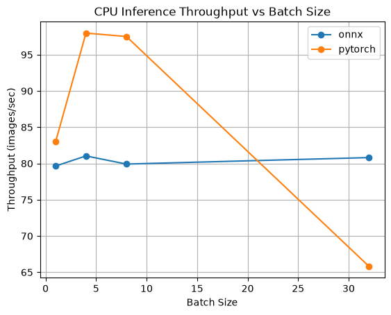
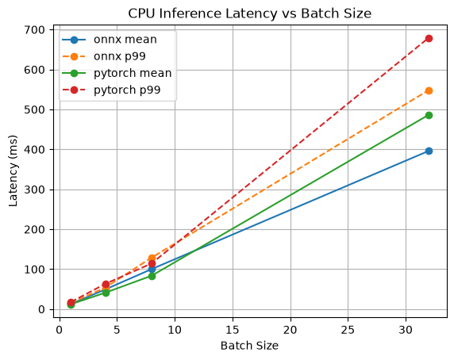
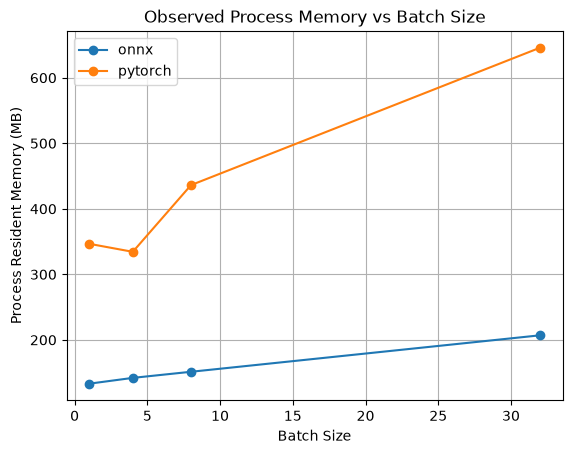

# ML Inference Optimization & Serving Platform

This is an ML systems project which was done to explore how inference runtime, hardware, batch size and request load affect the performance and efficiency of machine learning inference.

The purpose/goal of this project is to explore, learn and understand how the system around a trained model influences the inference performance and deployment tradeoffs. In the process of completion, I will also understand how to make machine learning inference faster and more efficient while measuring metrics such as latency, throughput, and memory usage.


## Project Goals

This project will compare:

* PyTorch vs ONNX Runtime inference
* CPU vs hardware acceleration
* Batch sizes 1, 4, 8 and 32 (stress case)
* p50, p95, and p99 inference latency
* Throughput
* Memory usage
* Performance under concurrent API request load
* Reproducible deployement using Docker

## Progress tracking

* [x] Set up Python virtual environment
* [x] Load pretrained ResNet18 with PyTorch
* [x] Preprocess local images for inference
* [x] Run image classification inference
* [x] Return top model predictions and confidence scores
* [x] Serve the model using FastAPI
* [x] Export ResNet18 to ONNX
* [x] Run inference with ONNX Runtime
* [x] Benchmark PyTorch vs ONNX Runtime
* [x] Visualize benchmark
* [x] Test batch sizes 1, 4, 8 and 32
* [ ] Compare CPU and hardware acceleration
* [x] Measure p50, p95, and p99 latency
* [x] Measure throughput and memory usage
* [ ] Load test the inference API
* [ ] Containerize the application with Docker

## Step 1 — PyTorch Inference

My first step was to use a pretrained ResNet model, specifically ResNet18, from TorchVision. I used this model because the purpose of my project is not to build a new AI model from scratch, but to test how fast and efficiently a model can run. ResNet18 is small enough to run on my computer and complex enough to give me valuable performance results.

The current inference pipeline is:

```text
Image (input)
  ↓
Image preprocessing
  ↓
PyTorch tensor
  ↓
ResNet18
  ↓
Model output
  ↓
Softmax probabilities
  ↓
Top 3 predictions 
```

Example output:

```text
Top 3 predictions:

soccer ball 44.67%
rugby ball 43.78%
baseball 3.25%
```

## Step 2 — FastAPI Model Serving

The pretrained ResNet18 model is linked to a FastAPI server so that the predictions made can be requested through HTTP instead of running the inference script manually.

### Serving Pipeline

```text
Image
  ↓
POST /predict
  ↓
FastAPI
  ↓
Image preprocessing
  ↓
ResNet18
  ↓
Top predictions
  ↓
JSON response
```

Example response:

```json
{
  "Filename": "dog_bluejay.jpeg",
  "Predictions": [
    {
      "Class": "Tibetan terrier",
      "Confidence": 0.5854
    },
    {
      "Class": "Maltese dog",
      "Confidence": 0.0931
    },
    {
      "Class": "Lhasa",
      "Confidence": 0.0853
    }
  ]
}
```

## Step 3 — ONNX Export and Validation

In this step, I successfully exported the same ResNet18 from PyTorch to the ONNX format and run ONNX Runtime inference. Then, I validated the exported model using the ONNX model checker. I wrote a script to run both PyTorch and ONNX Runtime inference and, compared the results using the same preprocessed inputs to verify that the exported model actually gives me the same predictions and, also to later compare the runtime. And now that step 3 is successful, the next question became; which inference/execution engine can handle the same workload better than the other? At the end of this experiment/project I should be able to answer that, alongside a question about whether the performance/deployment benefit is worth all this additional complexity from exporting.

```text
PyTorch ResNet18
       ↓
    Export
       ↓
     ONNX
       ↓
 ONNX Runtime
       ↓
Prediction validation
```

## Step 4 — Dynamic Batch Size Support

I updated the ONNX export so that the first input dimension is dynamic, while I kept the image dimensions fixed at 224×224 to make the exported graph and experimental setup simple.

The model was verified with batch sizes:

* `1`
* `4`
* `8`

for both PyTorch and ONNX Runtime.

```text
[batch, 3, 224, 224]
        ↓
     ResNet18
        ↓
[batch, 1000]
```

This step now prepares the project for benchmarking how batch size affects latency, throughput, and memory usage.

## Step 5 - CPU Performance Benchmarking

In this step, I used the same/identical preprocessed inputs to benchmark PyTorch and ONNX Runtime, comparing batch sizes 1, 4, 8 and 32 (extreme case) using latency, throughput, and memory usage.

Each configuration used:

- 20 warmup iterations
- 300 measured inference iterations
- 3 independent benchmark trials
- Batch sizes 1, 4, 8, and 32
- Default CPU execution/threading settings for each runtime

Reported results are averages across the three trials. End-to-end API performance will be measured separately during load testing.

### Benchmark Results

| Runtime | Batch Size | Mean Latency (ms) | p95 (ms) | p99 (ms) | Throughput (images/s) |
|---|---:|---:|---:|---:|---:|
| PyTorch | 1 | 11.67 | 13.82 | 18.41 | 86.74 |
| PyTorch | 4 | 35.96 | 39.58 | 44.83 | 111.35 |
| PyTorch | 8 | 70.47 | 77.79 | 84.25 | **113.57** |
| PyTorch | 32 | 483.42 | 584.88 | 708.03 | 66.21 |
| ONNX Runtime | 1 | 13.66 | 14.81 | 16.87 | 74.17 |
| ONNX Runtime | 4 | 51.89 | 62.21 | 68.83 | 77.14 |
| ONNX Runtime | 8 | 99.70 | 103.56 | 111.02 | 80.25 |
| ONNX Runtime | 32 | **395.98** | **423.51** | **466.84** | **80.81** |

### Throughput Plot



### Latency Plot



### Process Memory Plot



### Key Findings

- PyTorch achieved the highest CPU throughput at batch size 8 (sweet spot),
  reaching 113.57 images/s across the repeated benchmark tests.

- When the batch size for PyTorch increased from 1 to 4 it substantially 
  improved throughput, while increasing from 4 to 8 produced diminishing
  gains.

- At a batch size of 32, PyTorch throughput fell to 66.21 images/s,
  which indicated that the workload had moved beyond an efficient
  batching region on the tested hardware(CPU).

- ONNX Runtime throughput remained comparatively stable around
  74–81 images/s as the batch size increased.

- At a batch size of 32, ONNX Runtime outperformed PyTorch, achieving
  80.81 images/s compared to PyTorch's 66.21 images/s and reducing mean 
  batch latency from 483.42 ms to 395.98 ms.

- These results demonstrate that inference runtime and batch-size
  selection are workload and hardware dependent rather than one
  runtime being universally faster.

The benchmark was repeated across three independent test suites to reduce the impact of transient system noise and background activity. Each runtime's default threading configuration was used rather than forcing identical thread counts.

The experiment was made to also measure inference execution independently from preprocessing and API serving overhead. These components will be evaluated separately during load testing.

Process memory measurements use resident set size (RSS), which represents the memory occupied by the Python process and runtime rather than exact model-only or peak tensor memory.

Performance can also vary with operating-system scheduling, background activity, power state, and thermal conditions, which is why each benchmark configuration was repeated across three independent test suites.

```text
Preprocessed ResNet18 Input
           ↓
        Runtime
    ┌──────┴──────┐
    ↓             ↓
 PyTorch      ONNX Runtime
    ↓             ↓
Batch Size: 1 / 4 / 8 / 32
    ↓             ↓
  Warmup Inference Runs
           ↓
  300 Measured Inference Runs
           ↓
 Collect Performance Metrics
           ↓
Mean / p50 / p95 / p99 Latency
Throughput / Process Memory
           ↓
Repeat Across 3 Test Suites
           ↓
Aggregate Results
           ↓
Compare Runtime & Batch Tradeoffs
           ↓
Generate Benchmark Plots
```

## Technologies/Tools

* Python
* PyTorch
* TorchVision
* Pillow
* Git / GitHub
* FastAPI
* Uvicorn
* ONNX Runtime

Additional technologies will be introduced as the project develops, including ONNX Runtime, Locust, and Docker.

## Project file structure

```text
ML_inf_and_serving/
├── app/
│   ├── __init__.py
│   ├── main.py
│   └── model.py
│
├── benchmarks/
│   ├── benchmark.py
│   ├── prepare_input.py
│   ├── run_suite.sh
│   ├── summarize_results.py
│   ├── plot_results.py
│   │
│   ├── results/
│   │   ├── results_test1.csv
│   │   ├── results_test2.csv
│   │   ├── results_test3.csv
│   │   └── summary.csv
│   │
│   └── plots/
│       ├── throughput_vs_batch.png
│       ├── latency_vs_batch.png
│       └── memory_vs_batch.png
│
├── images/
│   ├── ball.jpg
│   ├── car.jpeg
│   ├── dog.jpg
│   └── dog2.jpg
│
├── models/
│   └── .gitkeep
│
├── scripts/
│   ├── export_to_onnx.py
│   ├── verify_onnx.py
│   ├── onnx_shape.py
│   └── verify_batch.py
│
├── predict_data.py
├── requirements.txt
├── .gitignore
└── README.md
```

## Setup

Clone the repository:

```bash
git clone https://github.com/YawPremuh/ML-inference-optimization.git
cd ML-inference-optimization
```

Create a virtual environment:

```bash
python3 -m venv .venv
source .venv/bin/activate
```

Install dependencies:

```bash
pip install -r requirements.txt
```

## Run Inference

Run the inference script with a local image:

```bash
python predict_data.py {image_path}
```

The predict.py script loads the ResNet18 model, preprocesses the selected image, runs inference, and prints the top 3 highest-confidence predictions.

## Planned Architecture

```text
                    Image Request
                          │
                          ▼
                       FastAPI
                          │
                     Preprocessing
                          │
              ┌───────────┴───────────┐
              ▼                       ▼
           PyTorch               ONNX Runtime
              │                       │
              └───────────┬───────────┘
                          ▼
                      Prediction
                          │
                          ▼
                  Performance Metrics
                          │
          ┌───────────────┼───────────────┐
          ▼               ▼               ▼
       Latency        Throughput        Memory
```

## Final Objective

The final project will experimentally answer:

> How can ML inference be made faster and more efficient under real request load? In other words, given the same trained ML model, how does the system around the model affect performance?

The conclusions to this question will be based on measured benchmark results rather than assumed performance improvements.
