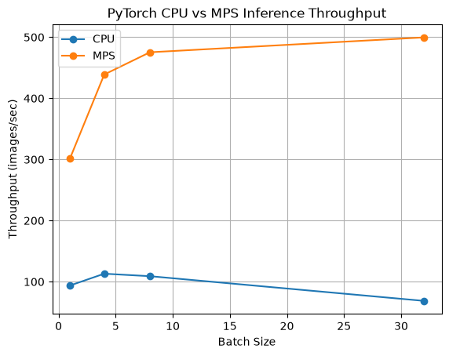
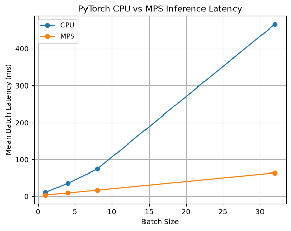
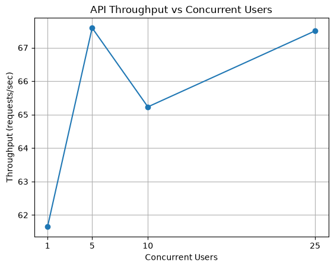
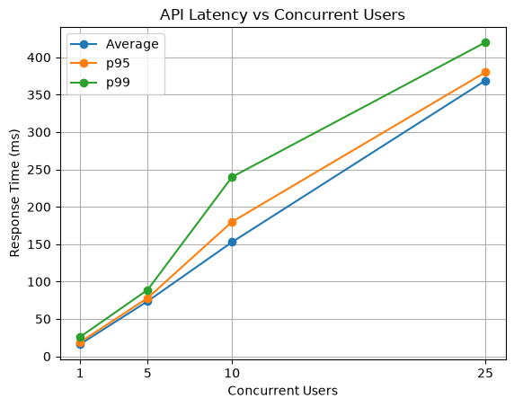

# ML Inference Optimization & Serving Platform

This is an ML systems project which was done to explore how inference runtime, hardware, batch size and request load affect the performance and efficiency of machine learning inference.

The purpose/goal of this project is to explore, learn and understand how the system around a trained model influences the inference performance and deployment tradeoffs. In the process of completion, I will also understand how to make machine learning inference faster and more efficient while measuring metrics such as latency, throughput, and memory usage.

The final project experimentally answered:

> How can ML inference be made faster and more efficient under real request load? In other words, given the same trained ML model, how does the system around the model affect performance?

## Project Goals

This project evaluates:

* PyTorch vs ONNX Runtime inference
* CPU vs hardware acceleration
* Batch sizes 1, 4, 8 and 32 (stress case)
* p50, p95, and p99 inference latency
* Throughput
* Memory usage
* Performance under concurrent API request load
* Reproducible deployement using Docker

## System Architecture

```text
                         Inference Serving Path

                              Image Request
                                   │
                                   ▼
                                FastAPI
                                   │
                                   ▼
                              Preprocessing
                                   │
                                   ▼
                           Prepared Input Tensor
                                   │
                                   ▼
                                PyTorch
                                   │
                                   ▼
                              Prediction
                                   │
                                   ▼
                              JSON Response


                         Benchmarking Pipeline

                           Prepared Input Tensor
                                   │
                 ┌─────────────────┼─────────────────┐
                 ▼                                   ▼
              PyTorch                           ONNX Runtime
                 │                                   │
          ┌──────┴──────┐                            │
          ▼             ▼                            ▼
         CPU           MPS                          CPU
          │             │                            │
          └─────────────┴────────────┬───────────────┘
                                     ▼
                         Performance Measurements
                                     │
              ┌──────────────────────┼──────────────────────┐
              ▼                      ▼                      ▼
           Latency               Throughput            Process RSS
       mean/p50/p95/p99           images/sec              memory
              │                      │                      │
              └──────────────────────┼──────────────────────┘
                                     ▼
                              Benchmark Analysis
```

## Step 1 — PyTorch Inference

My first step was to use a pretrained ResNet model, specifically ResNet18, from TorchVision. I used this model because the purpose of my project is not to build a new AI model from scratch, but to test how fast and efficiently a model can run. ResNet18 is small enough to run on my computer and complex enough to give me valuable performance results.

The current inference pipeline is:

```text
Image (input)
  ↓
Image preprocessing
  ↓
PyTorch tensor
  ↓
ResNet18
  ↓
Model output
  ↓
Softmax probabilities
  ↓
Top 3 predictions 
```

Example output:

```text
Top 3 predictions:

soccer ball 44.67%
rugby ball 43.78%
baseball 3.25%
```

## Step 2 — FastAPI Model Serving

The pretrained ResNet18 model is linked to a FastAPI server so that the predictions made can be requested through HTTP instead of running the inference script manually.

### Serving Pipeline

```text
Image
  ↓
POST /predict
  ↓
FastAPI
  ↓
Image preprocessing
  ↓
ResNet18
  ↓
Top predictions
  ↓
JSON response
```

Example response:

```json
{
  "Filename": "dog_bluejay.jpeg",
  "Predictions": [
    {
      "Class": "Tibetan terrier",
      "Confidence": 0.5854
    },
    {
      "Class": "Maltese dog",
      "Confidence": 0.0931
    },
    {
      "Class": "Lhasa",
      "Confidence": 0.0853
    }
  ]
}
```

## Step 3 — ONNX Export and Validation

In this step, I successfully exported the same ResNet18 from PyTorch to the ONNX format and run ONNX Runtime inference. Then, I validated the exported model using the ONNX model checker. I wrote a script to run both PyTorch and ONNX Runtime inference and, compared the results using the same preprocessed inputs to verify that the exported model actually gives me the same predictions and, also to later compare the runtime. And now that step 3 is successful, the next question became; which inference/execution engine can handle the same workload better than the other? At the end of this experiment/project I should be able to answer that, alongside a question about whether the performance/deployment benefit is worth all this additional complexity from exporting.

```text
PyTorch ResNet18
       ↓
    Export
       ↓
     ONNX
       ↓
 ONNX Runtime
       ↓
Prediction validation
```

## Step 4 — Dynamic Batch Size Support

I updated the ONNX export so that the first input dimension is dynamic, while I kept the image dimensions fixed at 224×224 to make the exported graph and experimental setup simple.

The model was verified with batch sizes:

* `1`
* `4`
* `8`

for both PyTorch and ONNX Runtime.

```text
[batch, 3, 224, 224]
        ↓
     ResNet18
        ↓
[batch, 1000]
```

This step now prepares the project for benchmarking how batch size affects latency, throughput, and memory usage.

## Step 5 - CPU Performance Benchmarking

In this step, I used the same/identical preprocessed inputs to benchmark PyTorch and ONNX Runtime, comparing batch sizes 1, 4, 8 and 32 (extreme case) using latency, throughput, and memory usage.

Each configuration used:

- 20 warmup iterations
- 300 measured inference iterations
- 3 independent benchmark trials
- Batch sizes 1, 4, 8, and 32
- Default CPU execution/threading settings for each runtime

Reported results are averages across the three trials. End-to-end API performance will be measured separately during load testing.

### Benchmark Results

| Runtime | Batch Size | Mean Latency (ms) | p95 (ms) | p99 (ms) | Throughput (images/s) |
|---|---:|---:|---:|---:|---:|
| PyTorch | 1 | 11.67 | 13.82 | 18.41 | 86.74 |
| PyTorch | 4 | 35.96 | 39.58 | 44.83 | 111.35 |
| PyTorch | 8 | 70.47 | 77.79 | 84.25 | **113.57** |
| PyTorch | 32 | 483.42 | 584.88 | 708.03 | 66.21 |
| ONNX Runtime | 1 | 13.66 | 14.81 | 16.87 | 74.17 |
| ONNX Runtime | 4 | 51.89 | 62.21 | 68.83 | 77.14 |
| ONNX Runtime | 8 | 99.70 | 103.56 | 111.02 | 80.25 |
| ONNX Runtime | 32 | **395.98** | **423.51** | **466.84** | **80.81** |

### Throughput Plot


### Latency Plot


### Process Memory Plot


### Key Findings

- PyTorch achieved the highest CPU throughput at batch size 8 (sweet spot),
  reaching 113.57 images/s across the repeated benchmark tests.

- When the batch size for PyTorch increased from 1 to 4 it substantially 
  improved throughput, while increasing from 4 to 8 produced diminishing
  gains.

- At a batch size of 32, PyTorch throughput fell to 66.21 images/s,
  which indicated that the workload had moved beyond an efficient
  batching region on the tested hardware(CPU).

- ONNX Runtime throughput remained comparatively stable around
  74–81 images/s as the batch size increased.

- At a batch size of 32, ONNX Runtime outperformed PyTorch, achieving
  80.81 images/s compared to PyTorch's 66.21 images/s and reducing mean 
  batch latency from 483.42 ms to 395.98 ms.

- These results demonstrate that inference runtime and batch-size
  selection are workload and hardware dependent rather than one
  runtime being universally faster.

The benchmark was repeated across three independent test suites to reduce the impact of transient system noise and background activity. Each runtime's default threading configuration was used rather than forcing identical thread counts.

The experiment was made to also measure inference execution independently from preprocessing and API serving overhead. These components will be evaluated separately during load testing.

Process memory measurements use resident set size (RSS), which represents the memory occupied by the Python process and runtime rather than exact model-only or peak tensor memory.

Performance can also vary with operating-system scheduling, background activity, power state, and thermal conditions, which is why each benchmark configuration was repeated across three independent test suites.

```text
Preprocessed ResNet18 Input
           ↓
        Runtime
    ┌──────┴──────┐
    ↓             ↓
 PyTorch      ONNX Runtime
    ↓             ↓
Batch Size: 1 / 4 / 8 / 32
    ↓             ↓
  Warmup Inference Runs
           ↓
  300 Measured Inference Runs
           ↓
 Collect Performance Metrics
           ↓
Mean / p50 / p95 / p99 Latency
Throughput / Process Memory
           ↓
Repeat Across 3 Test Suites
           ↓
Aggregate Results
           ↓
Compare Runtime & Batch Tradeoffs
           ↓
Generate Benchmark Plots
```
## Step 6 — Hardware-Aware Inference

After benchmarking PyTorch and ONNX Runtime on CPU, I investigated how the underlying hardware affected inference performance. But this time, I kept; the model, PyTorch runtime, input data, batch sizes, warmup count, and number of measured runs constant while changing only the execution device:

- CPU
- Apple MPS GPU acceleration

MPS operations were explicitly synchronized during benchmarking so that the measured latency represented completed accelerator execution rather than asynchronous command submission.

Each hardware configuration used:

- 20 warmup iterations
- 300 measured inference iterations
- 3 independent benchmark tests
- Batch sizes 1, 4, 8, and 32

### Hardware Benchmark Results

| Batch Size | CPU Mean (ms) | MPS Mean (ms) | CPU Throughput (img/s) | MPS Throughput (img/s) | MPS Speedup |
|---:|---:|---:|---:|---:|---:|
| 1 | 10.66 | 3.32 | 93.81 | 301.63 | 3.21× |
| 4 | 35.36 | 9.12 | 113.12 | 438.89 | 3.88× |
| 8 | 74.08 | 16.84 | 109.06 | 475.28 | 4.40× |
| 32 | 466.00 | 64.05 | 68.67 | 499.59 | 7.28× |

### CPU vs MPS Throughput



### CPU vs MPS Latency



### Key Findings

- MPS(GPU) significantly outperformed CPU inference across every tested batch size.

- The MPS(GPU) speedup increased as the batch size grew, from about **3.2× at batch size 1** to about **7.3× at batch size 32**.

- CPU throughput improved initially, where it reached about **113 images/s at batch size 4**, before declining as larger batches pushed the workload beyond an efficient CPU operating region.

- MPS(GPU) scaled much better with increasing batch size, rising from about **302 images/s at batch size 1** to about **500 images/s at batch size 32**.

- MPS(GPU) also showed diminishing returns. Batch size 8 achieved about **475 images/s**, while batch size 32 achieved about **500 images/s**. The larger batch increased throughput by only about 5% while increasing mean batch latency from **16.84 ms to 64.05 ms**.

- For this workload, batch size 8 therefore provided a more balanced MPS(GPU) latency-throughput operating point than batch size 32.

- The widening CPU-to-MPS(GPU) speedup at large batches was caused by both stronger accelerator scaling and degrading CPU performance, rather than the accelerator alone becoming proportionally faster.

### Device Placement Overhead

The initial hardware benchmark measured device-resident inference which means both the model and input tensor were moved to MPS before timing started. To estimate the practical cost of accelerator device placement, I also compared device-resident inference with a second benchmark that moved the preprocessed CPU tensor to MPS(GPU) inside the timed region.

| Batch Size | MPS Inference Only | Transfer + Inference | Added Latency | Relative Overhead |
|---:|---:|---:|---:|---:|
| 1 | 3.30 ms | 3.49 ms | 0.19 ms | ~5.9% |
| 8 | 16.68 ms | 17.23 ms | 0.55 ms | ~3.3% |
| 32 | 64.85 ms | 65.77 ms | 0.92 ms | ~1.4% |

The absolute device-placement cost increased with batch size particularly because larger tensors were involved, but the placement cost represented a smaller percentage of total execution time as the workload grew. This demonstrated another form of amortization, where the accelerator setup and placement overhead becomes less significant relative to useful computation for larger workloads.

## Step 7 — End-to-End API Load Testing

After I benchmarked model execution directly, I evaluated how the FastAPI inference service behaved under concurrent request load. In this step, Locust was used to repeatedly send multipart image requests to the `/predict` endpoint using the same input image for every test.

The baseline serving configuration used:

- 1 Uvicorn worker
- PyTorch CPU inference
- ResNet18
- Same input image across all tests
- 30/60-second test duration
- Zero simulated user think time
- Concurrent user levels of 1, 5, 10, and 25

Unlike the model-only benchmarks, the measurements in this step include the complete request path:

- HTTP request handling
- Multipart file parsing
- Image decoding
- Preprocessing
- Model inference
- Postprocessing
- JSON serialization
- HTTP response delivery

### Load Test Results

| Concurrent Users | Avg Latency (ms) | p95 (ms) | p99 (ms) | Throughput (req/s) | Failures |
|---:|---:|---:|---:|---:|---:|
| 1 | 16.19 | 19 | 26 | 61.65 | 0 |
| 5 | 73.73 | 78 | 89 | 67.59 | 0 |
| 10 | 152.83 | 180 | 240 | 65.23 | 0 |
| 25 | 368.88 | 380 | 420 | 67.50 | 0 |

### Throughput Under Load



### Latency Under Load



### Key Findings

- Throughput increased only by a bit from about 62 requests/sec at one user to about 68 requests/sec at five users.

- Increasing the concurrency beyond five users did not produce meaningful addition to the throughput. The service remained near approximately 65–68 requests/sec.

- Average latency increased substantially as the concurrency also increased:
  - 16.19 ms at 1 user
  - 73.73 ms at 5 users
  - 152.83 ms at 10 users
  - 368.88 ms at 25 users

- This indicates that the single-worker CPU serving configuration reached its effective capacity region quickly. Additional concurrency primarily increased waiting and queueing rather than completed request throughput.

- None of the requests failed during any of the tested concurrency levels, so overload manifested as increased latency rather than errors or crashes.

- These results demonstrate why model-only inference latency is not sufficient for evaluating a deployed ML service: client-visible performance depends on the complete request pipeline and behavior under concurrent load.

## Step 8 — Containerized Deployment

For this step, the FastAPI inference service was containerized with Docker to provide a reproducible runtime independent of my local Python virtual environment.

The container includes only the dependencies required to serve the model:

- Python 3.12
- FastAPI
- Uvicorn
- PyTorch
- TorchVision
- Pillow
- python-multipart

Some development and benchmarking dependencies such as Locust, ONNX Runtime, Pandas, and Matplotlib were not included in the serving image.

### Model Packaging

The pretrained ResNet18 weights are downloaded during the Docker image build rather than during container startup. This is to ensure that a newly started container can load the model without requiring a model download at runtime. The deployment image was scanned using Docker Scout.

The pretrained ResNet18 weights are downloaded during the Docker image build:

```dockerfile
RUN python -c \
    "from torchvision.models import resnet18, ResNet18_Weights; resnet18(weights=ResNet18_Weights.DEFAULT)"
```

### Build

```bash
docker build \
    --pull \
    -t ml-inference-platform:step8-final \
    .
```

### Run

```bash
docker run \
    --rm \
    --name ml-inference-api \
    -p 127.0.0.1:8000:8000 \
    ml-inference-platform:step8-final
```

### API Validation

```bash
curl http://127.0.0.1:8000/health
```

### Inference Endpoint

```bash
curl \
    -X POST \
    -F "file=@images/dog2.jpg" \
    http://127.0.0.1:8000/predict
```

## Setup

Clone the repository:

```bash
git clone https://github.com/YawPremuh/ML-inference-optimization.git
cd ML-inference-optimization
```

Create a virtual environment:

```bash
python3 -m venv .venv
source .venv/bin/activate
```

Install dependencies:

```bash
python -m pip install --upgrade pip
python -m pip install -r requirements.txt
```

## Run Inference

Run the inference script with a local image:

```bash
python predict_data.py {image_path}
```

The predict_data.py script loads the ResNet18 model, preprocesses the selected image, runs inference, and prints the top 3 highest-confidence predictions.

## Run the API

Start the FastAPI inference server:

```bash
python -m uvicorn app.main:app --reload
```
The API will be available:
```text
http://127.0.0.1:8000
```

Interactive API documentation: 
```text
http://127.0.0.1:8000/docs
```

### Available endpoints
* GET /
* GET /health
* POST /predict

## Export ONNX Model
```bash
python scripts/export_to_onnx.py
```

## Validate ONNX export
```bash
python scripts/verify_onnx.py
python scripts/verify_batch.py
```

## Run CPU Runtime Benchmarks
```bash
bash benchmarks/run_suite.sh
```

Generate summary:
```bash
python benchmarks/summarize_results.py
```

Generate plots:
```bash
python benchmarks/plot_results.py
```

## Run CPU vs MPS(GPU) Benchmarks
```bash
bash benchmarks/run_hardware_suite.sh
```

Generate summary:
```bash
python benchmarks/summarize_hardware.py
```

Generate plots:
```bash
python benchmarks/plot_hardware.py
```

## Run Load Tests
```bash
locust \
    -f load_tests/locustfile.py \
    --host http://127.0.0.1:8000 \
    --image images/dog2.jpg
```

## Technologies/Tools
* Python
* PyTorch
* TorchVision
* Pillow
* Git / GitHub
* FastAPI
* Uvicorn
* ONNX Runtime
* APPLE MPS(GPU)

### Serving
* FastAPI
* Uvicorn

### Benchmarking and Analysis
* psutil
* Pandas
* Matplotlib
* Locust

### Development
* Git
* GitHub

### Deployment
* Docker
* Docker Scout
* Linux

## Project file structure

```text
ML-inference-optimization/
│
├── app/
│   ├── __init__.py
│   ├── main.py
│   └── model.py
│
├── benchmarks/
│   ├── benchmark.py
│   ├── benchmark_hardware.py
│   ├── benchmark_transfer.py
│   ├── prepare_input.py
│   ├── run_suite.sh
│   ├── run_hardware_suite.sh
│   ├── summarize_results.py
│   ├── summarize_hardware.py
│   ├── plot_results.py
│   ├── plot_hardware.py
│   │
│   ├── results/
│   │   ├── summary.csv
│   │   ├── hardware_summary.csv
│   │   ├── results_test1.csv
│   │   ├── results_test2.csv
│   │   ├── results_test3.csv
│   │   ├── hardware_test1.csv
│   │   ├── hardware_test2.csv
│   │   └── hardware_test3.csv
│   │
│   └── plots/
│       ├── latency_vs_batch.png
│       ├── throughput_vs_batch.png
│       ├── memory_vs_batch.png
│       ├── cpu_vs_mps_latency.png
│       └── cpu_vs_mps_throughput.png
│
├── load_tests/
│   ├── locustfile.py
│   ├── summarize_load.py
│   ├── plot_load.py
│   │
│   ├── results/
│   │   ├── load_summary.csv
│   │   ├── users_1_stats.csv
│   │   ├── users_5_stats.csv
│   │   ├── users_10_stats.csv
│   │   └── users_25_stats.csv
│   │
│   └── plots/
│       ├── latency_vs_users.png
│       └── throughput_vs_users.png
│
├── scripts/
│   ├── export_to_onnx.py
│   ├── verify_onnx.py
│   ├── verify_batch.py
│   └── onnx_shape.py
│
├── images/
│   ├── ball.jpg
│   ├── car.jpeg
│   ├── dog.jpg
│   ├── dog2.jpg
│   └── dog_bluejay.jpeg
│
├── models/
│   └── .gitkeep
│
├── predict_data.py
├── Dockerfile
├── requirements.txt
├── requirements-api.txt
├── .dockerignore
├── .gitignore
└── README.md
```

## Conclusion

This project was completed to demonstrate that ML inference performance is determined by the interaction between the model and the system executing it.

The same ResNet18 model showed a different behavior depending on:
* runtime
* hardware
* batch size
* request concurrency
* deployment environment

The experiments done showed that:
- optimization choices must be benchmarked rather than making assumptions
- larger batches can improve throughput but increase latency
- accelerator performance improves when sufficient parallel work is available
- services can become latency-bound after reaching a throughput ceiling
- container dependency choices affect both image size and security
- correctness validation must come before performance optimization

The result is an end-to-end ML inference/serving platform that covers model execution, runtime optimization, hardware-aware benchmarking, API serving, load testing, containerization, and deployment security.
